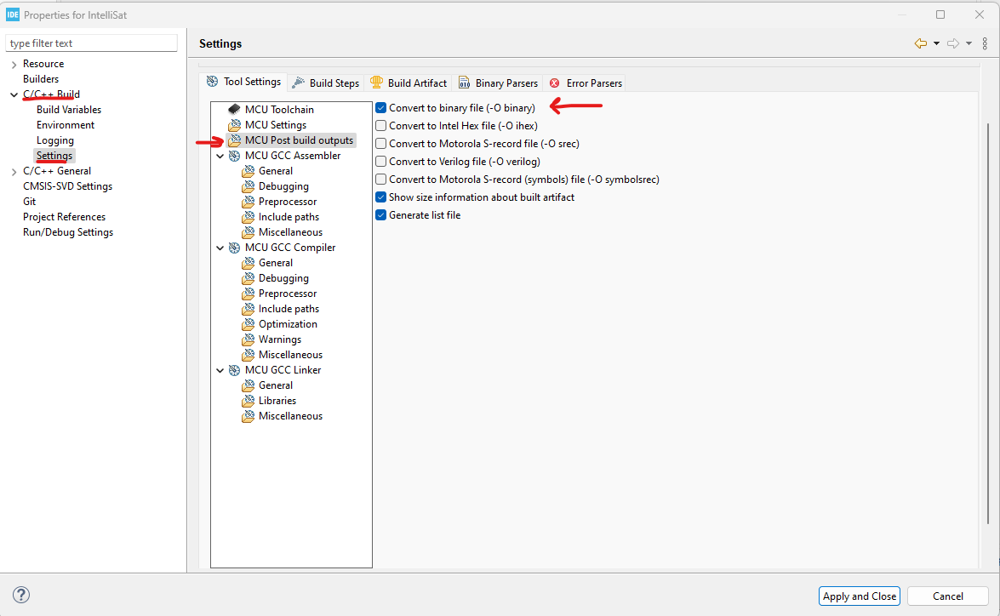
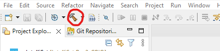
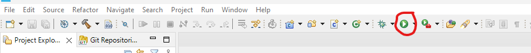
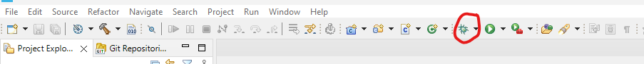

## Pre-requesites
This document assumes the following:
1. You have installed CubeIDE.
2. You have some programs (code, startup script, linker file) part of your project

__NOTE: Screenshots in this document might reference the IntelliSat code, but the same process can be followed for any "functional" code__

# Building
Building is the act of taking multiple programs and putting them into a single executable.
IMAGE
In the case of Embedded Programming, this executable can be either:
- Hex file
- Binary file

## Selecting the Build Outputs
While either of the two can be used, the way to select which one CubeIDE builds is:
1. In the _Explorer_ window, click on a __Project__ to select it. Press `Alt +Enter` to open the _Properties_ window
2. In the _Properties_ window, navigate to `C/C++ Build --> Settings`
3. In the _Settings_ section, click on `MCU Post build outputs`
4. There will be checkboxes to select which types of outputs must be build by the 'build process'

## Initiating the Build Process
There are a few ways to to build a project in CubeIDE:
- use the `Hammer` icon on the top pane \

- Right click on a source file in the Project (_Explorer_ window), and select the `Build Project` option.

The result of the build process can be seen in the _Console_ window. This is where you'll be informed if there are any errors that prevented the project the build. In case of errors, the IDE also highlights the files and lines of code that cause the error.

# Flashing
Flashing is the act of taking a built project (the Hex or Binary file), and uploading it onto an STM32 Processor for it to start executing the programs.

__NOTE: This section will require an STM32 based board to be connected to the PC where CubeIDE is running. Refer to [this document](../OrbitalPlatform_Hardware/STLink_Connect.md) for instructions on how to connect a board to the PC__

The easiest way to build a project in CubeIDE is to click on the `Play` icon on the top pane \

This will do the following things:
1. Build the Project (if it isn't build already)
2. Attempt to connect to the board to reprogram it
3. Start reporgramming the board

Each of these steps will be visible in the _Console_ window.

# Debugging
Debugging is the act of running a program, pausing it mid-execution, and analyzing different values to see if they are what we expect them to be. It's very helpful when finding mistakes in a program. The CubeIDE uses the `gdb` debugger behind the scenes, but it provides a nice interface on top.

__NOTE: This section will require an STM32 based board to be connected to the PC where CubeIDE is running. Refer to [this document](../OrbitalPlatform_Hardware/STLink_Connect.md) for instructions on how to connect a board to the PC__

To start debugging, click the `Bug` icon on the top pane \

When deugging for the first time, the IDE might ask you to set the 'Debug Configurations'. Since this is a slightly lengthy process, refer to Section 3.1.4 of the [CubeIDE Reference Manual](https://www.st.com/resource/en/user_manual/um2609-stm32cubeide-user-guide-stmicroelectronics.pdf) for instructions. \
__NOTE: For IntelliSat, there is no need to change the default debug configuration__

'Debugging' do the following:
1. Build the Project
2. Reprogram the board to run the executable
3. Enter Debug mode 

__There will be prompt to enter into `Debug Perspective`. Click `Yes`__ \
Then refer to following sections of the [CubeIDE Reference Manual](https://www.st.com/resource/en/user_manual/um2609-stm32cubeide-user-guide-stmicroelectronics.pdf) to understand how to use the CubeIDE debugger.
- 3.1.5
- 3.1.6.1
- 3.3

The CubeIDE debugger should be fairly easy to use if you are aware of the general concept of debuggers. \
There is also this video to assist in learning the CubeIDE debugger: https://www.youtube.com/watch?v=jbVgIK9Jlgk
