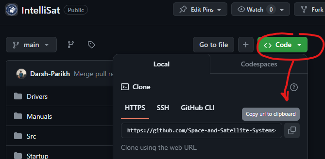
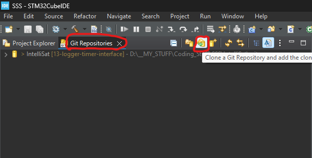
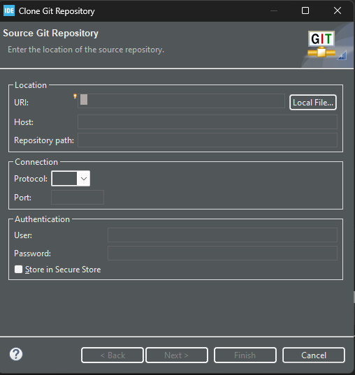
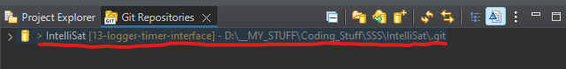
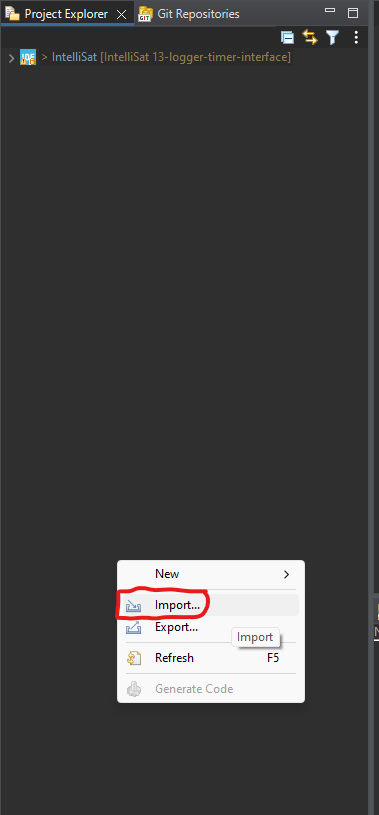
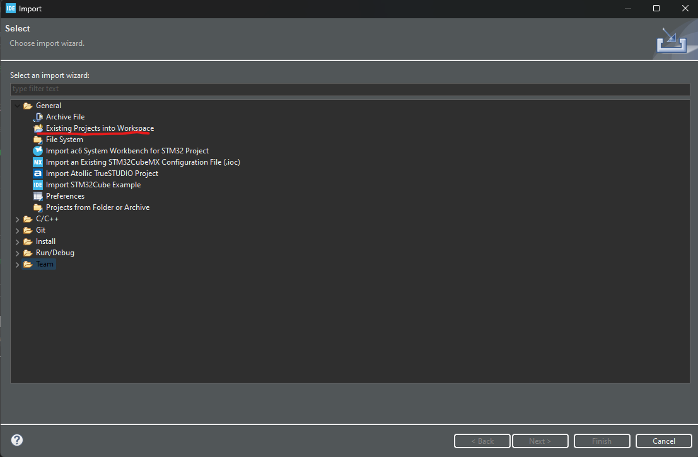

# Pre-requesites
This document assumes the following:
1. You have installed CubeIDE
2. You have a Github account, and a repository you want to clone and work on

# Step 1: Cloning
To clone a repository from Github, first thing you'd need is the link to it:

The rest of the steps take place on CubeIDE. In CubeIDE, open EGit's Git Repositories view. There you will find a cylindrical button for Cloning existing repositories.

On the window that pops up, paste the HTTPS link (from the first step) in the `URI` text box. Then fill out your rest of the text boxes with your Github credentials.

If you did everything correctly, you will see your repository in the Git Repositories window

# Step 2: Setting up as a Project
Cloning by itself isn't enough for workng on the repository. You won't be able to modify the files, or build the project. What you need is to set up your repository as a `Project`. To do so, first open the `Project Explorer` view. Then, in an empty section of that window, right-click to reveal the options:

On the window that pops up, select `General --> Existing Project into Workspace`.

On the next window, navigate to the location where you put the cloned repository. In case you can't find it, you can look at the repository in Git Repositries window (it should be shown there in parenthesis). 

Once you select it, you will see your repository pop up in the window. Select it and click `Finish`. Now you should see the repository in your Project Explorer tab/window.