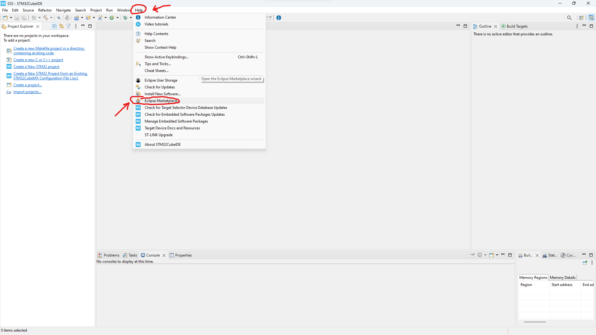
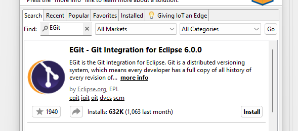
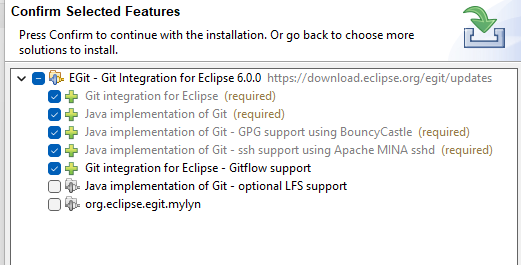
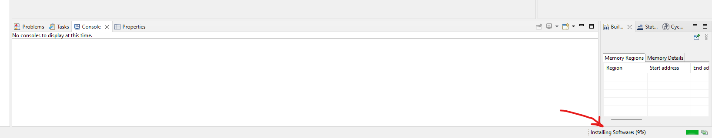
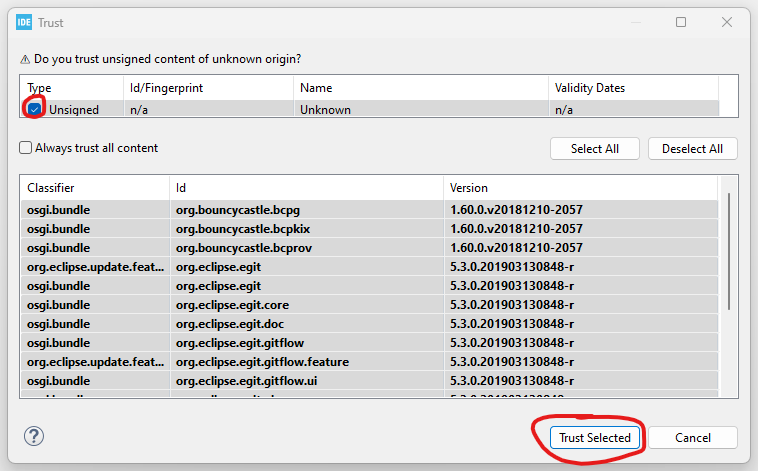
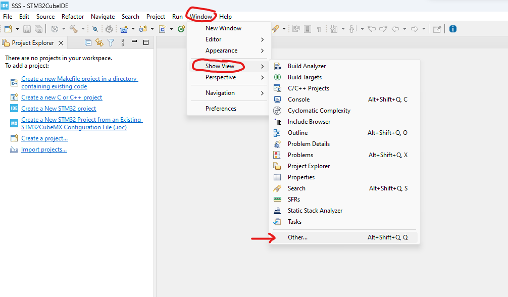
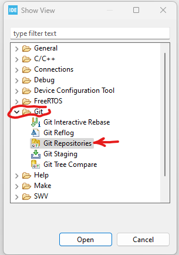

# EGit
Git support (for version controlling) can be achieved in CubeIDE using the EGit Plugin.

## Installing EGit
1. In the top panel, navigate to `Help -> Eclipse MarketPlace...` \

2. In the _Eclipse Marketplace_, search for `EGit`. Install EGit. The default options should be fine. Click on `Confirm`. The installation might take a minute or two. \

3. If the process stops midway requesting confirmation, select the default option and click `Confirm` \

4. Once the process is over, the window will close. CubeIDE will now show that it is installing the software \

5. When prompted with a window called *Trust*, check the box and click `Trust Selected`. \

6. Once the installation is over, you will need be asked to restart the IDE. Click on `Restart`.
7. When CubeIDE opens back up, navigate to `Windows -> Show View -> Others...` \

8. In the new window, open the `Git` section and click on `Git Repositories`. Click `open` \
 \
Do the same for `Git Staging`

9. The new window opens up in bottom right of the IDE. You have successfully installed and set up the EGit plugin

## Using EGit
The EGit Foundation has made a video tutorial to explain the usage of the pluging: https://www.youtube.com/watch?v=D73L9YlBlP8