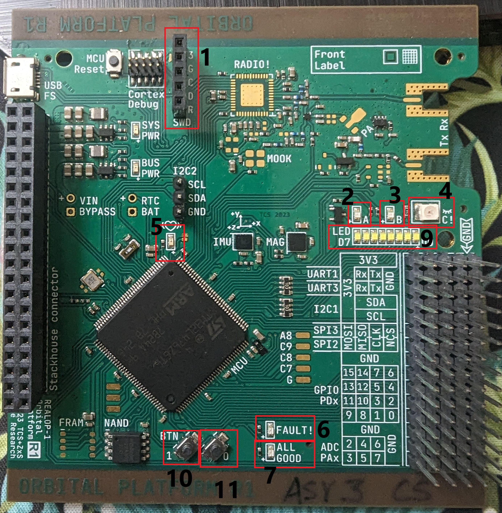
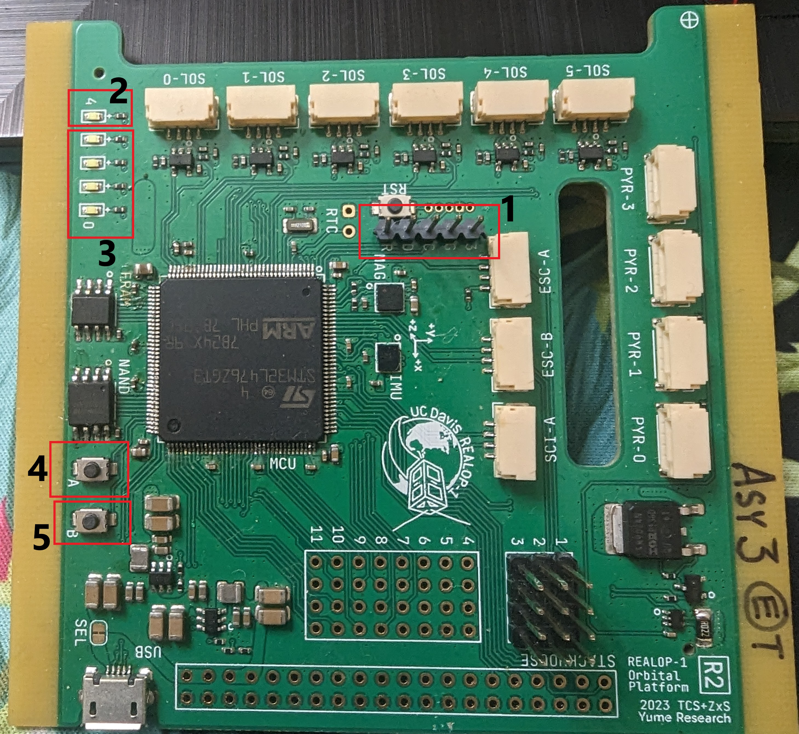

# Orbital Platform
The Orbital Platform is the primary computer for which IntelliSat was created. It features an STM32 processor along with external memory and avionics. Details on the chips can be found on the [SSS Electrical Team's Github repo](https://github.com/uwu64/orbital-platform)

Since IntelliSat allows access to certain Orbital Platform resources, it uses specific names for those resources. These names that might not align with the labels on the board, especially as IntelliSat tries to stay compatible with the different revisions of Orbital Platform. \
This document shows different sections of the Orbital Platform board, and what names IntelliSat gives them.

# OP Revision 1

| ID | Name          | User Interaction                                                                   | IntelliSat Interface
|----|---------------|------------------------------------------------------------------------------------|------------------------------------
| 01 | SWD Connector | Used to program and debug the board                                                |
| 02 | LED A         | Can be toggled via [_led.h_](../../Src/system_config/LED/led.h)                    | _led_a(bool)_
| 03 | LED B         | Can be toggled via [_led.h_](../../Src/system_config/LED/led.h)                    | _led_b(bool)_
| 04 | LED C         | Can be toggled via [_led.h_](../../Src/system_config/LED/led.h)                    | _led_c(bool)_
| 05 | LED Heartbeat | Blinks every 1 ms                                                                  |
| 06 | LED Fault     | Can be toggled via [_led.h_](../../Src/system_config/LED/led.h)                    | _led_fault(bool)_
| 07 | LED All Good  | Can be toggled via [_led.h_](../../Src/system_config/LED/led.h)                    | _led_ag(bool)_
| 09 | LED Dx        | Can be toggled via [_led.h_](../../Src/system_config/LED/led.h)                    | _led_dx(pin_number, bool)_
| 10 | Button 0      | Status can be accessed via [_button.h_](../../Src/system_config/Buttons/buttons.h) | _get_statusButton0(void)_ --> bool
| 11 | Button 1      | Status can be accessed via [_button.h_](../../Src/system_config/Buttons/buttons.h) | _get_statusButton1(void)_ --> bool

Additionally, there is a large sections of pins sticking out on the right side. __The labels show which peripherals use the pins__.  \
Details on which of these peripherals and pins are used under IntelliSat can be found in the Hardware Configurations google sheet.

# OP Revision 2

| ID | Name          | User Interaction                                                                   | IntelliSat Interface
|----|---------------|------------------------------------------------------------------------------------|--------------------------------------------------------------------
| 01 | SWD Connector | Used to program and debug the board                                                |
| 02 | LED Heartbeat | Blinks every 1 ms                                                                  |
| 03 | LED Dx        | Can be toggled via [_led.h_](../../Src/system_config/LED/led.h)                    | _led_d3(bool)_ , _led_d2(bool)_ , _led_d1(bool)_ , _led_d0(bool)_
| 04 | Button 0      | Status can be accessed via [_button.h_](../../Src/system_config/Buttons/buttons.h) | _get_statusButton0(void)_ --> bool
| 05 | Button 1      | Status can be accessed via [_button.h_](../../Src/system_config/Buttons/buttons.h) | _get_statusButton1(void)_ --> bool

Additionally, there is a small set of pins sticking out on the right side. Details on these pins: https://docs.google.com/spreadsheets/d/1t28qB5q2Co_uhu8WwbYkCaqFcHMT7WsT/edit?rtpof=true#gid=1164169023 . \
Details on which of these peripherals and pins are used under IntelliSat can be found in the Hardware Configurations google sheet.