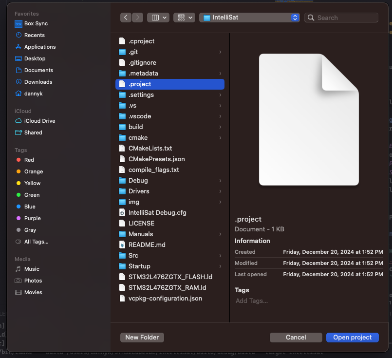

# Importing ST projects into Visual Studio Code

Based on the article of the same name by Microsoft. Read the original
[here](https://devblogs.microsoft.com/cppblog/importing-st-projects-into-visual-studio-code/).

## Pre-requisites
This document assumes the following:
- The following is installed:
- STM32CubeIDE/STM32CubeMX
- Visual Studio Code (vs code)
- Embedded tools extension ([link](https://marketplace.visualstudio.com/items?itemName=ms-vscode.vscode-embedded-tools)) (version 0.3.0 or greater)
- vcpkg (See separate [guide](./vcpkg.md))
- A configured STM32CubeIDE/STM32CubeMX project

### Highly Recommended
Optional but make development easier
- C/C++ extension ([link](https://marketplace.visualstudio.com/items?itemName=ms-vscode.cpptools))
- CMake Tools extension ([link](https://marketplace.visualstudio.com/items?itemName=ms-vscode.cmake-tools))
- Cortex-Debug extension ([link](https://marketplace.visualstudio.com/items?itemName=marus25.cortex-debug))
- RTOS-Views ([link](https://marketplace.visualstudio.com/items?itemName=mcu-debug.rtos-views))
- MCU-Debug ([link](https://marketplace.visualstudio.com/items?itemName=mcu-debug.memory-view))

# Import
With our prerequisites installed, from within Visual Studio Code in the command pallet (\<Ctrl>+\<Shift>+\<P>) (\<command>+\<shift>+\<P>) run “Create project from ST project”.


## From CubeIDE

1. Navigate to where your ST .cproject is and select it.



2. Select either the debug or release configuration

## From CubeMX

1. Open the context menu and open STM32CubeMX for your project.


One benefit of this over the IDE is that changes to the project will automatically cause the CMake cache to be regenerated.


## ==**Very important**==

- If you open the project again in STM32CubeIDE you will need to exclude the build directory used by CMake from your project. Right click the build directory and select Resource Configurations > Exclude from Build.


- If your project is created with CubeIDE, any time the project configuration is changed within CubeIDE, the import process must be repeated again in VS Code.

Even if it is a existing project, it is very much recommended to repeated import process again if the code is moved to a new computer (such as via cloning). Often, difference such as the build environment/operating system will cause build related commands to failed (some examples include ninja/cmake is missing)

## Debug/deploy

- Connect the board with st link/usb cable
- To start debugging, select [Run] > [Start Debugging].

## Tips

Sometimes in the STM32CubeIDE samples, the project may be in a subdirectory of the source code. If you do not see your project files in the file view this may be why. Select the CMake targets view and you should see everything that CMake has used to generate the build.

When generating projects using STM32CubeMX, leave the default selected in the Project Manager for “Generate Under Root”. This will keep your .cproject in the root of the folder with the generated source files. This is how STM32CubeIDE generates projects by default as well.

If your build fails and you see something like this:

```
[build] /Users/dannyk/STM32CubeIDE/IntelliSat/Src/sys/sysmem.c:30:35: error: use of undeclared identifier 'NULL' [build] static uint8_t *__sbrk_heap_end = NULL;
```
or
```
[build] clang: warning: argument unused during compilation: '-mcpu=cortex-m4' [-Wunused-command-line-argument]
[build] clang: warning: argument unused during compilation: '-mfpu=fpv4-sp-d16' [-Wunused-command-line-argument]
[build] clang: warning: argument unused during compilation: '-mfloat-abi=hard' [-Wunused-command-line-argument]
```

See if you have a CMakeCache.txt anywhere in you directory (most likely `build/debug/build/CMakeCache.txt`), delete it and restart the build process.

Make sure that the version of cmake required by vcpkg is high enough. All available version can be found in 