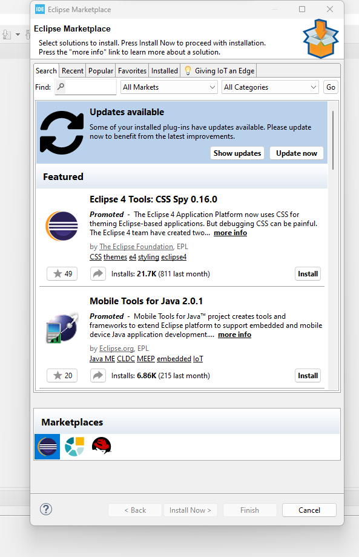
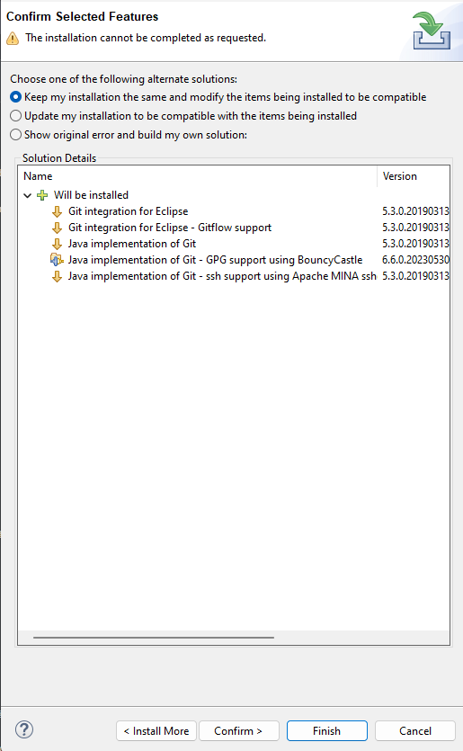
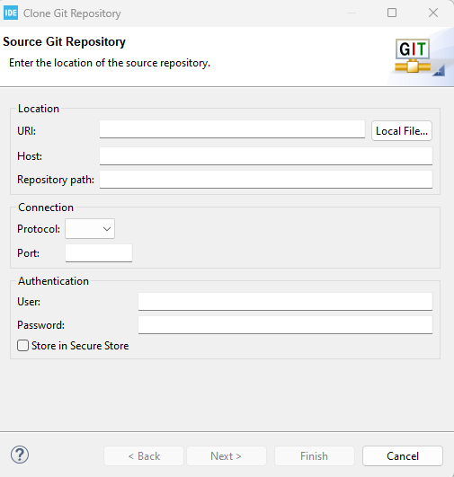
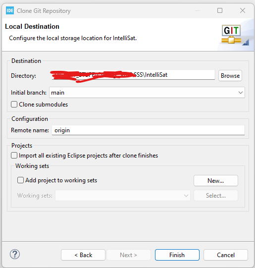
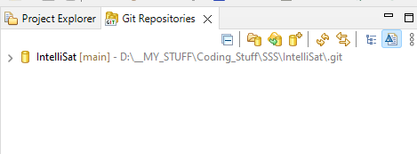
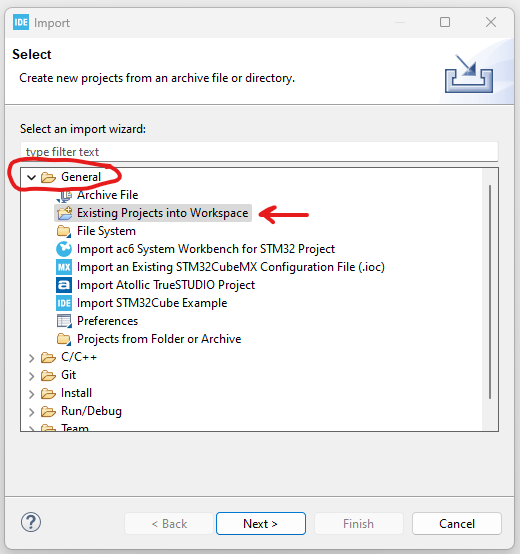
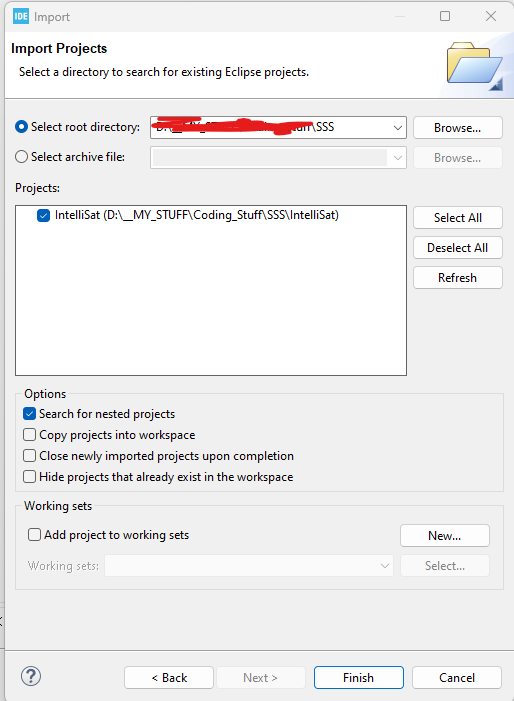
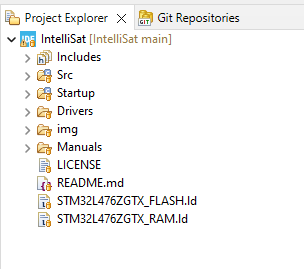
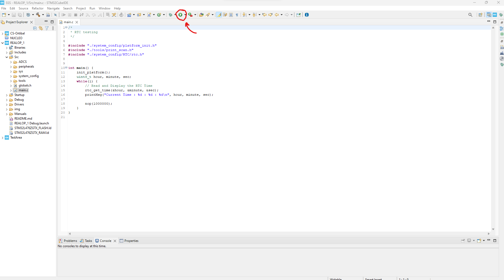
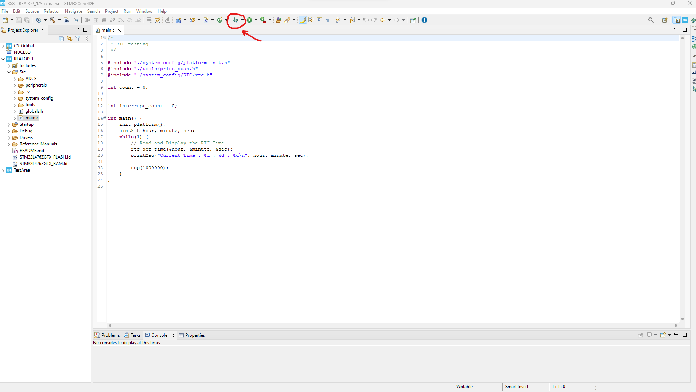

# Computer Systems Oribtal 
Welcome to code respository for the Space And Systems Satellite Club's REALOP 1 Flight Software! The code here will be run on our flight computer, the Orbital Platform, which will be responsible for controlling and monitoring the CubeSat's various subsystems. Details regarding the Orbital Platform are available on this github repository: [uwu64/orbital-platform](https://github.com/uwu64/orbital-platform).

**NOTE**: Several images of the board or connectors aren't attached yet since the Orbital Platform is back in Davis. Wait a few weeks and the images will be here.

## REALOP 1

**NEEDS TO BE FILLED OUT**

## Getting Started
To get started with our code, you'll need to have a basic understanding of C programming and the tools we're using. You'll need to follow the instructions listed in the following sections:
- [Prerequisites & Requirements](#Prerequisites-&-Requirements)
- [Developing on the board](#Developing-on-the-board)


## Prerequisites & Requirements

A list of software that must be installed before hand:

### [GNU ARM Toolchain](https://developer.arm.com/Tools%20and%20Software/GNU%20Toolchain)
The Toolchain can be installed in any folder of your liking. The version we are currently working with is `12.2.MPACBTI-Rel1`

### [STM32CubeIDE](https://www.st.com/en/development-tools/stm32cubeide.html#get-software)

#### Installer
Scroll to the very bottom of the CubeIDE installation page, and click `Get Latest` for whichever Operating System your computer runs. A license agreement form will pop up. Click `Accept`, and you'll be prompted to enter an email. Once that is done, check that mail's inbox. There should be an email by ST. Open it and click on the `Download now` button. You should be taken back to the same installation website, except this time the browser will prompt you to download the installer (or automatically download depending on the browser settings).

#### Installation
Follow this guide by ST : [Cube IDE Installation Guide](https://www.st.com/resource/en/user_manual/dm00603964-stm32cubeide-installation-guide-stmicroelectronics.pdf)
#### Starting CubeIDE
When you open CubeIDE, it'll prompty you to slect a workspace. To keep things seperate, it is recommended to make a folder somewhere on your computer just for the REALOP FSW. Then use that as the workspace. An example:


Upon clicking `Launch`, the IDE will open

#### EGit
Before setting up anything else, first get Git integration in the CubeIDE. In the top panel, navigate to `Help -> Eclipse MarketPlace...`. Clicking on it opens a new window.




There, search for `EGit`. Install EGit. The default options should be fine. Click on `Confirm`. The installation might take a minute or two.




If the process stops midway requesting confirmation, select the default option and click `Confirm`


Once the process is over, the window will close. CubeIDE will now show that it is installing the software


When prompted with a window called *Trust*, check the box and click `Trust Selected`.


Once the installation is over, you will need be asked to restart the IDE. Click on `Restart`.

When CubeIDE opens back up, navigate to `Windows -> Show View -> Others...`


In the new window, open the `Git` section and click on `Git Repositories`. Click `open`


The new window opens up in bottom right of the IDE.

#### Cloning the Intellisat repository

Click on `Clone a Git Repository`. A new window will open



Fill it out with the following info:
```
URI      :  https://github.com/Space-and-Satellite-Systems-UC-Davis/IntelliSat.git
User     :  github Email
Password :  github Personal Access Token
```
The rest of the necessary fields will fill up by themselved. Leave the others as is. Click `Next`. The window will display a list of branches to clone. Select whichever ones you want, and then click `Next`. You'll be asked where to clone the repo. Click on `Browse` and navigate to the location of the workplace, and select that folder.



Click `Finish`. After some time, the Git Repo window will show the Intellisat repo.



The code can't be built and tested yet. To allow for that, go the the `Project Explorer` and click on `Import Projects...`. In the *Import* window, click on `Existing Projects into Workspace` under the `General` section.



In the next window, select the `Select root directory` option. Make sure the directory is the workspace directory, where the repo from earlier was cloned. *Intellisat* must be visible as a project. Make sure it's selected, then click `Finish`. When done, the Intellisat project will be visible in the Projects window.




#### IntelliSat Project Properties

With the Intellisat project selected in the *Projects* window, press `Alt + Enter`. A properties window will open. Navigate to `C/C++ Build -> Settings`. Make the following changes:


Click `Apply and Close`. Now the project can be worked on.


## Developing on the board

### Physically connecting to the board
We use ST-LINK V2 to connect to the board. The ST-LINK USB Connector already has wires attached to it, with labels on each wire.

IMAGE ./img/physical_settings/

The Orbital Platform has a connector port on it's topside, with labels that correspond to the wires on the ST-LINK Connector. 

IMAGE ./img/physical_settings/

Connect the Port and the Connector to each other by matching the labels.
If the compuer is powered on, the Platform should start getting power, and start running whatever program is loaded on it. Since the `Heartbeat` LED blinks every second in our FSW, it's blinking will be a clear indication of things working.

IMAGE ./img/physical_settings/


### Flashing the Platform
With ST-LINK V2, fashing can be done right through the CUBE IDE. Before flashing, make sure the Orbital Platform is connected. Then make sure the REALOP Project is open in the IDE. Flashing can be done by pressing the `Run` in the top pane of the IDE.



This will first rebuild the project and then try connecting to the Platform. Once both are done, it will flash the program onto the Platform

**NOTE**: Once this is completed, the Platform will start running the code immediately.

### Debugging the Platform
In order to debug, make sure to have a breakpoint at some line in your code (ideally close to whichever component you think is failing). Then, make sure the Platform is physically connected. Press the `Debug` icon on the top pane. There will be a prompt to enter the `Debugger Layout`. Press `Yes`.



The debugger will open up

IMAGE ./img/work/

The project will be built and flashed onto the Platform, and the IDE will have the normal tools found on most debuggers (such as single stepping, stepping over, watching expressions, looking at registers, etc), and will stop execution once it hits a breakpoint).
NOTE: The Startup file might open whenver the program starts. This is normal behavior.


## Resources
The folder `Manuals` contains pdf copies of the reference manuals, datasheets, and programming guides of the various chips on the Platform.

- [EGit Tutorial](https://eclipsesource.com/blogs/tutorials/egit-tutorial/)
- [DoxyGen](https://www.doxygen.nl/manual/index.html)
- API Doc (NOT ADDED YET)
